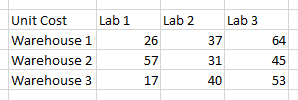

In this section we will talk about the different parts of a spreadsheet, what makes them different, and how we can use their features to our advantage. 

## Components of a Spreadsheet

While we have probably used a spreadsheet in Excel for one reason or another, you probably haven't given much thought to the different components of that spreadsheet. We will go through a quick primer to make sure that we are all on the same page.

**Rows** are the horizontal series of data in your spreadsheet. They are indexed with letters, starting at 1. Rows typically store data for one *observation* - the data for one sample that you have run for example. There is usually one piece of information in a row that is unique from the other rows, like a sample number or a part number.

**Columns** are the vertical component of your data. They are indexed with letters. Columns typically have the data for one field or variable for all of the observations - the weight of each of the samples for example. The headings for the columns should be descriptive and it is helpful if they have the unit of measure. It is not good practice to use the letter as your only way to identify the column, as they can be moved or deleted.

**Cells** are the smallest component of a spreadsheet. A cell represents the value for one variable for one observation - the weight of sample #0001 for example. They are represented by the column letter and row number (for example, A1 is the cell in the top left corner of your spreadsheet). 

## Data Types 

You can view and change the data type for a cell, row, or column using the **Format Cells...** option in the pop-up menu for whichever of those components you choose. This affects both how Excel stores the data and how it displays the data. Formatting can be applied to entire columns or cells, and rows, but less commonly.

There are two basic types of data: **numbers** and **text**. 

### Numbers

Excel has a lot of ways to work with numbers, which makes sense since that is what it was made to do. It is important to know what kind of number Excel thinks you have entered because sometimes it guesses without your input, and it often guesses in ways that can drastically affect your calculations.

Dates are the most commonly discussed example of how Excel messes with your numeric data. If your number is in a form that Excel thinks *might* be a date, it will likely change it to be a date. Some examples are:
- 12/12/2012
- 2012-12-12
- 12/12
- 12-12
- Dec-12-2012
- December 12, 2012

Excel will *display* all of these in a way that is human-readable as a date, but it *stores* them as a 5-digit number. So for our example of December 12, 2012, it is actually stored in Excel as 41255. That number is the number of days since January 1, 1900 (01/01/1900) minus 1 (the original date is "1", not "0"). If you export your data to something other than Excel this formatting may be lost, leaving you with the basically meaningless number. 

Excel will automatically format other kinds of numbers as well:
- any value with numbers and an **e** in the middle will automatically get converted to a Scientific Number (ex. 1e9 becomes 1.00E+09)
- any value stored as a number with a leading **0** will have that 0 dropped. This can be problematic for serial numbers and zip codes in New England (02155 is not the same as 2155). We will talk about a fix in the next section
-  the default number of decimal places is 2, so it may add numbers after the decimal where you don't want or drop digits that you do want
-  Excel can only handle 15 total digits in a single number, including after the decimal place; it will round the digits after those initial 15 to 0

### Text

Excel can also store values as text, sometimes referred to as labels. The default format type assigned to cells with text is General.

In some cases you may want to store numbers as text. This is especially relevant for IDs that are composed entirely of numbers, like zip codes or serial numbers. Excel will call out these cells and ask if you want to convert them to numbers, but you can ignore this warning.

> ## Simple Example
> Through this workshop we will go through the steps of preparing the data for one simple problem from beginning to end. 
> 
> You run a distribution center at a medium-sized university with three different campus locations. Labs on each of those campuses need 300 widgets each. Widgets are stored at three different warehouses around the area, each of which has a limited supply: Warehouse 1 has 150, Warehouse 2 has 300, and Warehouse 3 has 450. 
> As the warehouses and labs are not co-located, there are different costs involved in getting the widgets from warehouse to lab. Those costs are as follows:
> 
{: .callout}

> ## What is wrong with this table?
>
> The table shown above shows the values we will need to calculate the best way to distribute the widgets to the labs, but it didn't start out looking that clean. 
> 
> Download the spreadsheet available here: [original spreadsheet](../data/20200117-EngiExcel-step0.xlsx).
>
> There are 3 data-type/number types in this version of the spreadsheet. While the values will *probably* act the same when we use them in calculations, that is not necessarily the case. The lack of consistency also makes them hard to evaluate just by looking at them, which could be confusing to future users of the spreadsheet. To move on with the example we will need to choose a number type and to find and correct the inconsistent cells.
>
> > ## Solution
> > 
> > The three data types are **Number**, **Currency**, and **Text**. You can tell because of the decimal places, $ signs, and the left justification of the bottom right cell.
> >
> > In this example you could use either the "General", "Number" (with 2 decimal places), or "Currency" number types. Since we aren't going to be using the accounting functions and the fact that the table is labeled as "Unit Cost", we will use "Number". It is the simplest option that clearly identifies the values as numeric.
> >
> > You can highlight the whole table and change all of the data types at once. Highlight and call up the menu, choose **Format Cells...** and choose **Number**.
> >
> {: .solution}
{: .challenge}

   

 



