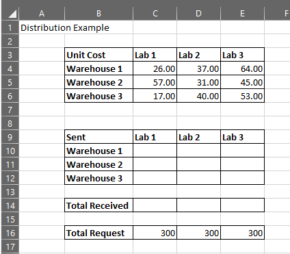

The data in spreadsheets often needs to be human readable in addition to being something that the computer can understand. In this episode, we will look at ways to make our spreadsheets easy to understand.

> ## Conditional Formatting
>
> Conditional formatting can be a quick way to get a look at your data. You can apply conditional formatting by selecting the cells you want to include and choosing the **Conditional Formatting** pull-down menu on the **Home** ribbon. There are different kinds of conditional formatting, but a simple example is using **Color Scales** to apply a gradient to show the values from greatest to least. 
> It is important to remember that sometimes the things we can see in a spreadsheet have no meaning to the computer, so if you transfer data from one format to another you may lose key information. Below is an example:
>
> 
>
> This is our example table, but with conditional formatting applied - yellow is the lowest to bright green for the  highest. This formatting makes it easy for us to see what is happening in the table, but the analysis of which numbers are higher or lower is limited to Excel. This information would have to be calculated in the context of another statistics program. The same would apply if we manually **bolded** the numbers we wanted to use or made the text a different color.
{: .callout}

## Formatting for Clarity

There are lots of things we can do in Excel to make our tables easier to understand. The simplest way is to outline our discrete sections of data and bolding the headings. For example:

As we go forward with our example we will talk about some more strategies:

> ## Add the cells for the rest of the problem
> 
> The first section of data for the problem shows the amount it costs to send each widget from each of the warehouses to each of the labs. The problem we are trying to solve with that data is to **find the most cost-effective way to ship 300 widgets to each of the labs from warehouses that have the following supply: Warehouse 1 - 150, Warehouse 2 - 300, Warehouse 3 - 450**. 
> 
> The element that we are going to ask Excel to calculate for us is the shipments from the warehouses and to the labs. In order to use solver later, we will **set up a table to hold that data**. We will also set up **rows and columns to hold the other requirements that need to be fulfilled that are mentioned above**.
>
{: .challenge}

## Lining Up Rows and Columns

First we will add the table that will contain the final values for the shipments. This table will be blank (no values, no formulas) until we use Solver to solve the problem. It will mirror our original table.

When you are creating multiple tables in the same spreadsheet that have columns with the same headers, it is good practice to line those tables up either by the rows or the columns. In this case, we will put the new table **below** the original, so we should line up the columns that relate to each of the Labs. Putting a couple of rows between the tables will make them easier to differentiate. You want to add these details as early as possible, as adjusting rows and columns later could affect your formulas. 

Your spreadsheet should now look like this:

Notice that we included the outlines for the cells and the bolded headers.

We also need to add the numbers of widgets available and required. As the required widgets are related to the labs, we can put the row for this data below our shipment table. For our calculations, we will also need a row that will contain a formula to make sure the total number of widgets going to each lab is equal to the request. 

We will put in the row for the formulas first. We will label this row **Total Received**. The columns will line up with the lab headers.

After one blank row, we will add the column with the widgets requested. The label will be **Total Request** and each of the columns for the labs will have a value of **300**. 

The table will now look like this:

We can also add the original stock of widgets for each warehouse. Since the data associated with each warehouse is stored in rows, we will put a new column to the right of our blank Shipments table. As with the data for the labs, we will add a blank column for the formulas we will need to make sure that the total getting shipped from the warehouse doesn't exceed the stock.

After one blank column, add a column for the **Total Sent**, leave a column, and one for the **Total Stock**. Make sure the rows line up with the appropriate warehouse and put in **150**, **300**, and **450** for Warehouse 1, 2, and 3, respectively. 

The final version of the formatted spreadsheet should look like this:

 



