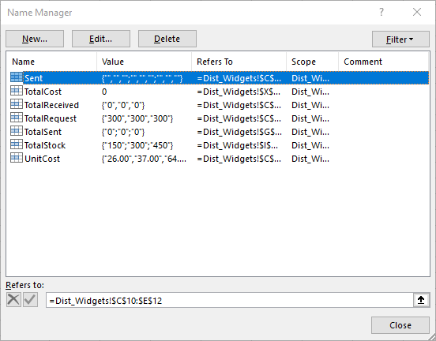

The ability to use formulas in Excel is one of the features that makes it useful to scientists and engineers. There are many built in functions that we can use to prepare our example Distribution spreadsheet for Solver in the next episode.

> ## = versus '=
> 
> Adding an equals sign (**=**) at the beginning of the value in a cell is the way to tell Excel that you want to use a function (formula) to calculate the value of that cell. In some cases, though, you may want to actually have an equals sign show up in the cell. 
> 
> To accomplish this we will use an **escape** character. This is a term that you will hear in other programming languages as well. There are a couple of options that you can use in Excel: **/** or **'** before the character that is causing you problems is the option I typically use. 
> 
{: .callout}

We have already created the rows and columns for the formulas related to the what the labs have asked for and what the warehouses have in stock, so let's fill those in now.

## Adding up data

There are two ways you can add up data in a spreadsheet. The first is:

~~~
=C10+D10+E10
~~~
{: .source}

This way is okay when you have a small number of cells to add together, but there is a more efficient way to get the same result:

~~~
=SUM(C10:E10)
~~~
{: .source}

Excel functions are always shown in call capital letters. The SUM function takes the cells that you want to sum as an **argument**, inside the parentheses. You can choose them individually or as a range of cells. In this case we are adding up the number of widgets sent from Warehouse 1 to all of the labs, which is found in cells C10, D10, and E10. 

We can choose the cell with this formula and copy it down to the cells for Warehouse 2 and 3. This is accomplished by clicking on the corner of the cell you want to copy and dragging it down. The formula will adjust so that it is summing the data for each row instead of only for row 10.

The same principles work for copying across rows. We can go to the cell for the **Total Received** by the labs and calculate the sum by adding the widgets sent from each 

## Cell References 
 
Cell references are denoted by the use of the **$**. Below you will learn what it means when you see the $ related to the index of a cell or groups of cells.

The reason that copying the function down in the example for the warehouses works is because the references to the cells are **relative**. That means that the links between the function and the cells it uses in the calculation are dynamic, and that if you copy or move the function to a new cell Excel will guess what new cells you want to use relative to where it is in the spreadsheet. Excel **assumes relative references, so you don't use the $ at all**. 
 
If you want to create links that are static, you will need to tell excel that the reference is **absolute**. This means that no matter where in the spreadsheet the reference appears, it will always refer to the same cell(s). You can create an absolute reference by **including a $ before the column and row number in the index for the cell**. For example, if we wanted to specifically refer to the number of widgets shipped from Warehouse 1 to Lab 1 in our example, we would us **$C$10**. This works inside of functions in the same way.
 
You can create a **mixed reference** as well, by choosing to use $ in front of *either* the column index (ex. $C10) *or* the row index (ex. C$10). This is a tricky kind of reference and the one you are least likely to use.

## Defining Named Cells

You can give names to cells or ranges of cells to make it easier to reference them in functions later on. Now that we have seen how functions work using cell indices, let's **Define Names** to use in our last function. We are going to be calculating the total cost of shipping the widgets sent from each warehouse to each lab so that we can find the way that costs the least. This will require us to multiply the array representing **Unit Cost** by **Shipment**, and then adding all of those values together.

Select the cells that you want to name. Once that is done, go to the **Formulas** tab in the ribbon and choose **Define Name**. The box will look like this:

   

We will name this selection **UnitCost** and set the **Scope** to be the worksheet we are using. For Scope, if you leave it as "Workbook" it will mean you can use that named selection of data in other sheets, but you can't name another selection with the same name. Notice that the **Refers to:** is **=Dist_Widgets!$C$4:$E$6**. The first part of the reference is the sheet we are in (mine is called Dist_Widgets) followed by an **absolute reference** to the cells. While I don't recommend this, if you move the cells the name will follow those cells. It will also expand if you add rows or columns, but it will not necessarily do that consistently. 

>## Naming Good Practice
>
> You can only use letter, numbers, and underscores in the names. Excel will try and guess what you want to name the range, but you will want to check it to make sure it makes sense. As is good practice when naming folders and files, keep the name short but descriptive. If you are going be naming many ranges in a spreadsheet or workbook you might consider thinking about a naming convention and writing it down with your other documentation.
{: .callout}

We can now reference that selection of cells by using the name **UnitCost** instead of the range of cells.

> ## Challenge
>
> We need to name the selection of cells that has the number of widgets sent to each lab from each warehouse. Based on the procedures above, name this selection **Sent** with a scope limited to the worksheet.
>
> In order to prepare for using Solver, we will also name the following ranges. Try it yourself, but we will also go through it together.
>  
{: .challenge}

## Using Functions on Named Arrays

Let's add the final function that we will need to run Solver to find out the best way to get the widgets from the Warehouses to the Labs. We will put this in the cell in the bottom right corner of your dataset, on mine it is I16. Put a label in the cell above it that says **Total Cost**. 
     
The SUMPRODUCT function that we are going to use works in a very similar way to SUM. In the cell you have identified as **Total Cost**, we are going to put in the following function:

~~~
=SUMPRODUCT(UnitCost, Sent)
~~~
{: .source}

The cells in the function should be highlighted in different colors, with the names shown in the same color in the function bar like this:

> ## Your Spreadsheet is Ready for Solver!
> 
> Your spreadsheet is now ready to be used to solve the problem we set out at the beginning of the lesson. We want to figure out how many widgets we need to send from each warehouse so that each lab receives 300 widgets. 
{: .challenge}    



