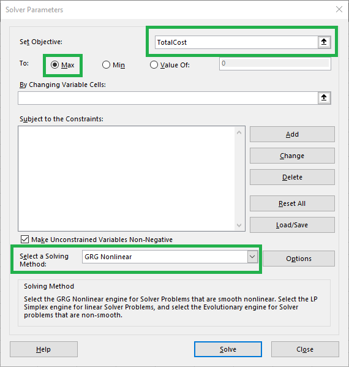

## Adding Solver to the Data Ribbon

Solver is built in to Excel, but it may not automatically show up. It should be in the Data ribbon in the **Analyze** section. If it is not there, you can go to the **File** menu and choose **Options**. Go to **Add-ins** and choose **Excel Add-ins** from the **Manage:** menu and click **Go...**. Make sure that the **Solver Add-in** is checked.

  

## Solver for our Distribution Example

The initial Solver window is shown in the image below. The default values are highlighted with green borders.

Solver correctly guessed that the **Objective** of our analysis is the **TotalCost**. This is the value that is the goal of our analysis. We can ask it to look for the **Max** (which is the default), the **Min** (which is actually what we want - the lowest possible total cost of sending the widgets where they need to go), or **Value Of:** (where you can set a specific value as the objective).

**Choose the Min button instead of Max**. 

The second choice we need to make in Solver is to indicate the **Variable Cells**. These are the cells that Solver will adjust to find the solution to our problem, in this case the number of widgets to each lab from each warehouse. 

**Type Sent in the By Changing Variable Cells: box.**

The next box allows us to set additional contraints on our analysis. In our case, the Total Sent from each warehouse can't exceed the Total Stock and the Total    

  



