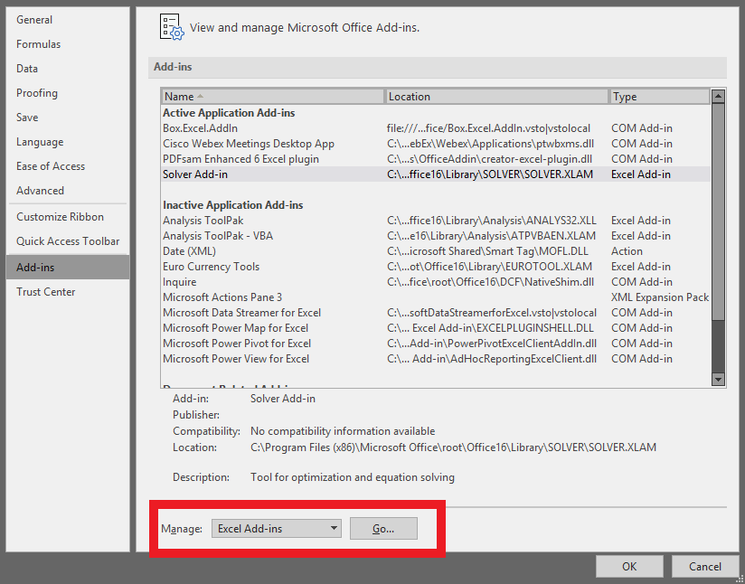
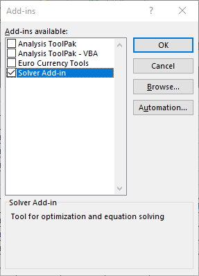

## Adding Solver to the Data Ribbon

Solver is built in to Excel, but it may not automatically show up. It should be in the Data ribbon in the **Analyze** section. If it is not there, you can go to the **File** menu and choose **Options**. Go to **Add-ins** and choose **Excel Add-ins** from the **Manage:** menu and click **Go...**. Make sure that the **Solver Add-in** is checked.

  

## Solver for our Distribution Example

  



